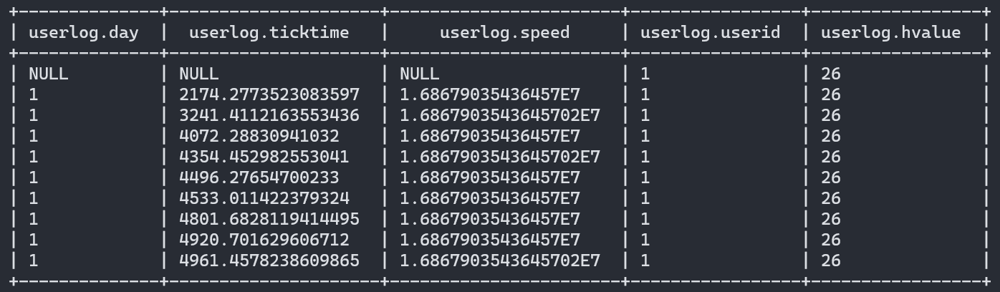
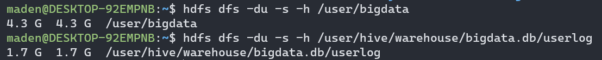

# Практика 6

## Порядок выполнения

В файле $HADOOP_HOME/etc/hadoop/mapred-site.xml добавить:

    <property>
        <name>mapreduce.jobhistory.address</name>
        <value>localhost:10020</value>
    </property>

Запустить:

    $HADOOP_HOME/sbin/start-all.sh

    $HIVE_HOME/bin/hive --service metastore &
    $HIVE_HOME/bin/hive --service hiveserver2 &

Создать директорию в dfs и положить в нее файлы:

    hdfs dfs -mkdir /user/bigdata
    hdfs dfs -put /home/maden/bigdata/rawdata/v5/* /user/bigdata

Проверить, что файлы добавились:

    hdfs dfs -ls /user/bigdata

Запустить скрипт создания таблиц:

    $HIVE_HOME/bin/beeline -n maden -u jdbc:hive2://localhost:10000 -f create_tables.hql

Проверить, что данные доступны во внешней таблице (ограниченное количество записей):

    $HIVE_HOME/bin/beeline -n maden -u jdbc:hive2://localhost:10000
```
use bigdata;

select *,
cast(substr(split(split(INPUT__FILE__NAME, "/")[5], "[.]")[2], 2) as int) as userid,
cast(substr(split(split(INPUT__FILE__NAME, "/")[5], "[.]")[1], 2) as int) as hvalue
from external_userlog
limit 5;
```

Выйти (Ctrl+C)

Запустить перенос данных:

    $HIVE_HOME/bin/beeline -n maden -u jdbc:hive2://localhost:10000 -f move_data.hql


## Результат:

    Loading data to table bigdata.userlog partition (userid=null, hvalue=null)
         Time taken to load dynamic partitions: 8.088 seconds
         Time taken for adding to write entity : 0.013 seconds
    MapReduce Jobs Launched:
    Stage-Stage-1: Map: 16  Reduce: 19   Cumulative CPU: 3760.73 sec   HDFS Read: 4651657312 HDFS Write: 1792370858 SUCCESS
    Total MapReduce CPU Time Spent: 0 days 1 hours 2 minutes 40 seconds 730 msec

Проверяем, что данные доступны в таблице:

    $HIVE_HOME/bin/beeline -n maden -u jdbc:hive2://localhost:10000

    use bigdata;
    select * from userlog limit 10;



## Сравнение объема данных:

